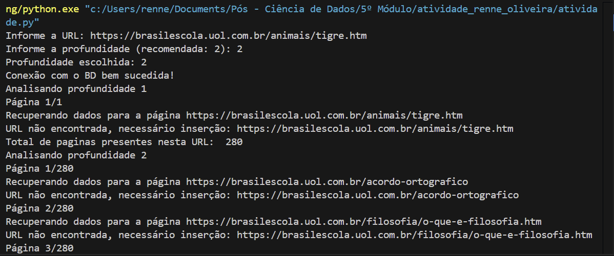

# Crawler e Buscador

Atividade desenvolvida para simular um crawler e um buscador.

 
A atividade realizada tem como objetivo recuperar informações da Web e com os resultados obtidos, realizarmos uma busca das melhores Urls que retornem a informação que desejamos.

Para o correto funcionamento, é necessário garantir que:

- O banco de dados está configurado corretamente, para isto, além de garantir que o schema esteja criado (arquivo script_bd.sql), é necessário alterar as credenciais de conexão ao banco, no arquivo atividade.py (linha 16-19), a conexão é realizada apenas neste local do código, facilitando a troca de credenciais.
- Se possua conexão com a internet para realizar o crawler.
- Garantir que o ambiente Python possua os pacotes e bibliotecas utilziadas, os comandos de instalação estão comentados caso haja necessidade. (Ambiente python conda 3.12.4 utilizado para desenvolvimento e teste)

O arquivo atividade.py deve ser executado, este integra os dois módulos de código (crawler e buscador), criados baseando-se nos slides da disciplina.

No início da execução será solicitada uma URL para que o crawler recolha as informações, para teste, foi utilizado a URL https://brasilescola.uol.com.br/animais/tigre.htm, com profundidade 2 (recupera o HTML da página e das páginas filhas), armazenando em banco o resultado de 280 páginas, o início da execução pode ser visto na imagem resultados_crawler.png.

Os resultados quantitativos do crawler em banco, podem ser vistos na imagem resultados_bd.png.

Após isso o programa solicita duas palavras a serem pesquisadas, aqui é importante salientar a dificuldade com o uso de radicais, como realizamos o processo de "stem" nas palavras, foram salvos em bancos apenas os radicais das mesmas, devemos escrever palavras de forma de radicais para serem buscadas. Para teste foi usado as palavras "felin tigr".

Os resultados da pesquisa posem ser visualizados na imagem resultados_pesquisa.png e resultados_pesquisa2.png. Há diferença nos resultados de acordo com o tipo de score utilizado.

Para os scores de peso, a seguinte lógica foi colocada:

- Valores de frequência foram multiplicados por 1% (0.01)
- Valores de distância por serem inversamente proporcionais, temos a constante de 100 arbitrária, menos o valor da distância, dividido por 30 também arbitrário.
- A localização também é inversamente proporcional, porém apresenta escalas de valores muito maiores que a distância, desta vez a constate foi 1000, e a divisão realizada por 200.

Ao final os 3 valores são somados.

Scores de páginas significativas possuiram valores próximos entre 1 a 5 (1 a 10 somados), o objetivo era que cada score em média representasse 30% do valor. Páginas não significativas apresentam valores até mesmo negativos.

Esta atividade foi desenvolvida para a disciplina de pós graduação: Recuperação de Dados da Web  
